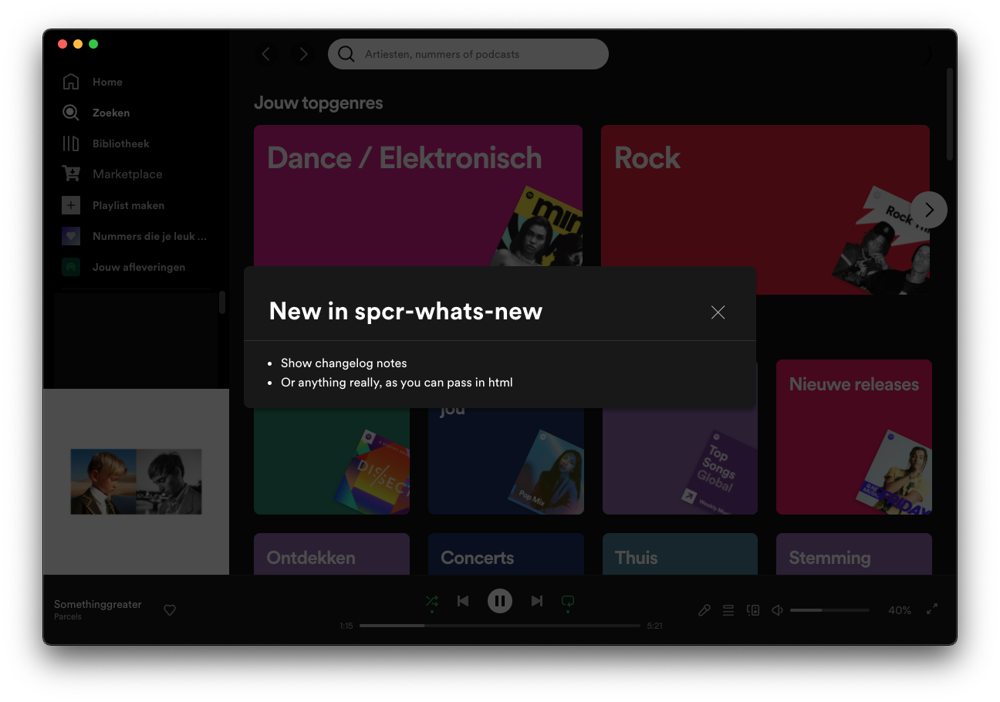

# What's new
Spicetify creator plugin to show update notes in a modal on every version bump.  
Only shows the modal once per update, and only on new versions (not on fresh installs).



## Installation
```sh
npm install spcr-whats-new
```

## Usage
```tsx
import React from 'react';
import whatsNew from 'spcr-whats-new';

const jsxElement = (
    <p>Lorem ipsum dolor sit amet</p>
);

whatsNew(
    'whats-new',
    '1.0.0',
    {
        title: `New spcr-whats-new v1.0.0`,
        content: jsxElement
        isLarge: true,
    }
);
```
The `whatsNew` methods accepts 3 arguments:
* `appName` (string): name of the app/extension. Used to save the version number to localstorage
* `version` (string): version number of the app.
    - **Must** be [semver](https://semver.org)
    - It's recommended to use the `version` field from `package.json`. That way the modal will automatically show when changing the version in `package.json`. *Don't forget to update the change notes though!*  
    For an example see [advanced usage](#advanced-usage)
* `content` ([SpcrWhatsNewModalContent](https://github.com/jeroentvb/spcr-whats-new/blob/master/src/types/modal-content.model.ts)): object with the following keys:
    - title (string): Title of the modal
    - content (JSX.Element): jsx element
    - isLarge (boolean - *optional*): show large modal 

## Advanced usage
<details>
<summary>Using package.json version number (recommend)</summary>

```tsx
import React from 'react';
import whatsNew from 'spcr-whats-new';
import { version } from 'path/to/package.json';

const jsxElement = (
    <p>Lorem ipsum dolor sit amet</p>
);

whatsNew(
    'whats-new',
    version,
    {
        title: `New in spcr-whats-new v${version}`,
        content: jsxElement,
    }
);
```
</details>
<details>
<summary>Using react-markdown to show update notes using markdown</summary>

```tsx
import React from 'react';
import whatsNew from 'spcr-whats-new';
import ReactMarkdown from 'react-markdown';
import { version } from '../../package.json';

// Can be exported from separate file
const CHANGE_NOTES = `
* The quick brown fox
* jumps over the lazy dog
`;

const markdown = (
    <ReactMarkdown children={CHANGE_NOTES} />
);

whatsNew(
    whatsNew(
        'whats-new',
        version,
        {
            title: `New in spcr-whats-new v${version}`,
            content: markdown,
            isLarge: true,
        }
    );
);

```
</details>

